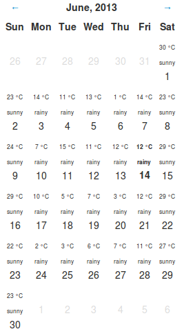

# yii-ecalendarview

ECalendarView is Yii extension widget.
It renders calendar with custom content of day cells.
It is inspired by CListView with two differences:

* Items are rendered into calendar table instead of list.
* Item model consists of day's date instead of CModel.

## Features

* Customizable content of day cells.
* Can be rendered in three pagination modes - month, week and day.
* Month can be rendered with 1 - 3 weeks in a row.
* Can be rendered with Monday or Sunday as the first day of week.
* Custom css and localization possible.
* Ajax updates.

## Requirements

Tested on Yii 1.1.13.

## Installation

* Download and extract to extensions directory.
* Set path alias in config/main.php.


```
Yii::setPathOfAlias('ecalendarview', dirname(__FILE__) . '/../extensions/ecalendarview');
```

## Usage

Put calendar into view file.


```
<?php $this->widget('ecalendarview.ECalendarView'); ?>
```

All attributes are preconfigured to default values.
Complete configuration looks like following.

```
<?php $this->widget('ecalendarview.ECalendarView', array(
  'id' => 'MyCalendar',
  'weeksInRow' => 1,
  'itemView' => '_view',
  'titleView' => '_title',
  'cssFile' => 'css/calendar.css',
  'ajaxUpdate' => true,
  'dataProvider' => array(
    'pagination' => array(
      'currentDate' => new DateTime("now"),
      'pageSize' => 'month',
      'pageIndex' => 0,
      'pageIndexVar' => 'MyCalendar_page',
      'isMondayFirst' => false,
    )
  )
)); ?>
```

* *id* - The identifier of calendar. It must be unique for each calendar rendered on the same view. If not defined, it is auto-generated.
* *weeksInRow* - The number of weeks that is be rendered in one row. Valid values are 1 - 3. Has effect only with *pageSize* set to 'month'.
* *itemView* - The view to be used to render each day. If not defined, default view is used. Inside of view following data can be accessed:
  * *DateTime $data->date* - The date of day.
  * *boolean $data->isCurrent* - Tells if the day is selected.
  * *boolean $data->isRelevant* - Tells if the day is not only padding in the beginning and end of the month page.
  * *CBaseController $this* - The controller.
* *titleView* - The view to be used to render month and year information on the top of calendar. If not defined, default view is used. Inside of view following data can be accessed:
  * *ECalendarViewPagination $pagination* - The pagination of calendar.
* *cssFile* - The css file to be used to style calendar. Path is relative to application root. If not defined, default css file is used.
* *ajaxUpdate* - Tells if page navigation should be performed using ajax calls if possible. If not defined, true is used.
* *currentDate* - The date selected in calendar. If not defined, current date is used.
* *pageSize* - Pagination style. Can be set to 'month', 'week' or 'day'. If not defined, 'month' is used.
* *pageIndex* - The page index. If not defined, 0 is used. This attribute is overwritten by url request attribute if set.
* *pageIndexVar* - The name of url request attribute that holds current page index. If not defined, concatenation of auto-generated *id* and '_page' is used.
* *isMondayFirst* - Tells if Monday is rendered as first day of week, or Sunday. If not defined, false is used.

## i18n

You can provide message bundle *ecalendarview* to translate/modify names of days and months. Eg. file *&lt;app-root&gt;/protected/messages/en/ecalendarview.php* can look like following:


```
<?php

return array(
  'Sun' => 'Sunday',
  'Mon' => 'Hated-day',
  ...
  'January' => '1st month',
  'February' => 'Feb',
  ...
);
```

If you need better control over calendar title ("January, 2014") please have a look on property *titleView* described above.

## Example

*Ultimate Weather Forecast* is application that can foresee/backsee weather in any time of the future and history.
The predictions are highly accurate, but the location for each day forecast is unknown.

1. Create *ForecastController* with action *forecast* and view *forecast*.

2. Add method to controller that do forecast:


```
public function getForecast($date) {
  $weekdayIndex = $date->format('N') - 1;
  if($weekdayIndex < 5) {
    $temperature = rand(0, 15) . ' °C';
    $conditions = 'rainy';
  } else {
    $temperature = rand(20, 30) . ' °C';
    $conditions = 'sunny';
  }

  return array(
    'temperature' => $temperature,
    'conditions' => $conditions,
  );
}
```

3. Define *views/forecast/_view.php* like following:


```
<?php if($data->isRelevantDate): ?>
  <?php $forecast = $this->getForecast($data->date); ?>
  <span style="font-size: 60%;"><?php echo $forecast['temperature']; ?></span> <br/>
  <span style="font-size: 60%;"><?php echo $forecast['conditions']; ?></span> <br/>
<? endif; ?>

<?php echo $data->date->format('j'); ?>
```

4. Render calendar in *views/forecast/forecast.php*:


```
<?php $this->widget('ecalendarview.ECalendarView', array(
  'itemView' => '_view',
)); ?>
```

